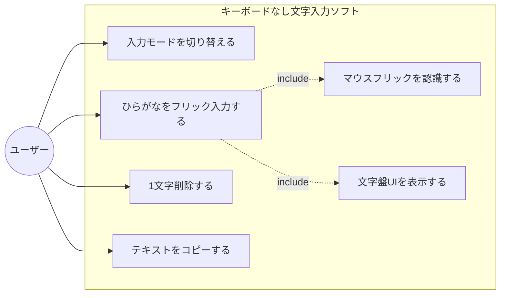
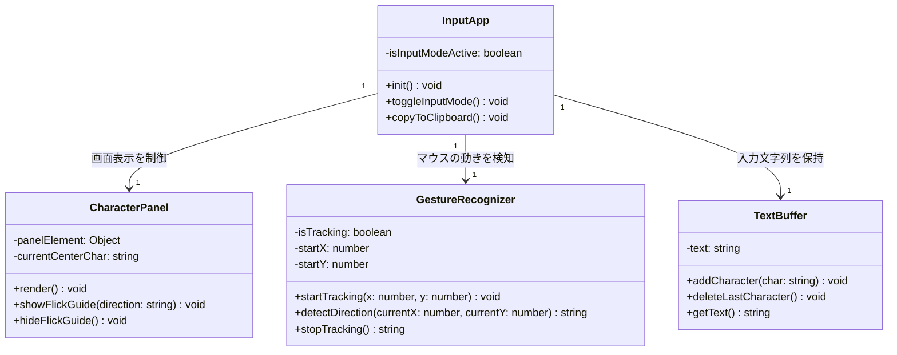
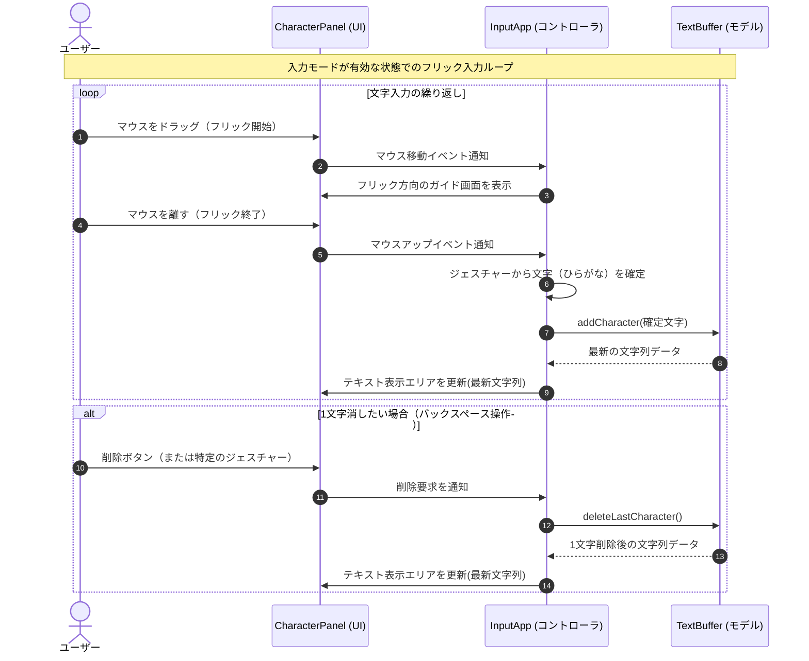
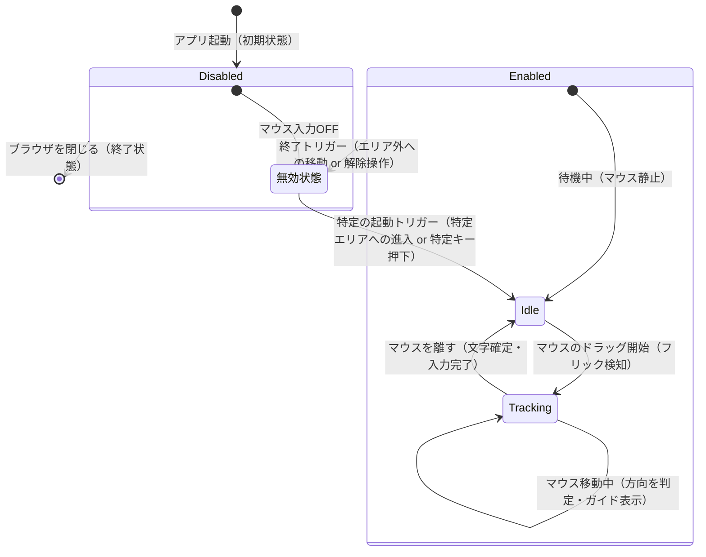

# キーボードなし文字入力ソフト

椅子にもたれかかった楽な姿勢のまま、キーボードに手を伸ばさずマウス操作（フリック等）だけで快適・高速に文字入力を行うためのWebアプリケーションです。

## 1. 要件定義（5要素）

* **【目的】** 椅子にもたれかかった楽な姿勢のまま、キーボードに手を伸ばさずマウス操作（フリック等）だけで快適・高速に文字入力を行う。
* **【利用者の入出力】** 画面上のUIパネル（文字盤）を見ながら、マウスの動きで文字を選択・入力する ➔ 入力されたひらがながテキストエリア等に表示される。
* **【制約】** Webブラウザ上で動作するWebアプリであること。
* **【受け入れ基準】** 最低限、ひらがな50音の入力と表示ができること。
* **【非目標】** カタカナや英数字モードの実装、漢字変換などは今回は作らない（スコープ外）。

## 2. 機能一覧と優先度

### コア機能（アプリの核となる部分）

* **マウスジェスチャー（フリック）認識機能** 【優先度：高】
* マウスの動いた方向（上下左右など）を検知して、どの文字が選ばれたかを判定する機能。

* **文字盤UI表示機能** 【優先度：高】
* スマホのフリック画面のような、視覚的に分かりやすい入力パネルを画面に表示する機能。

* **テキスト出力エリア** 【優先度：高】
* 入力されたひらがなを画面上に次々と表示していくエリア。

### サポート機能（あると便利な部分）

* **一字削除（バックスペース）機能** 【優先度：高】
* 入力を間違えたときに、マウス操作で1文字消せる機能。

* **テキストコピー機能** 【優先度：中】
* 入力したひらがなを一発でクリップボードにコピーして、他のサイトやアプリに貼り付けられるようにする機能。

* **入力モード切り替え（特定の場合のみ起動）** 【優先度：中】
* 常にマウス入力を受け付けると疲れるため、特定のボタンを押している間だけ、または特定の範囲内だけでフリック入力を有効にする切り替え機能。

### 共通機能（システム全体のベース）

* **画面レイアウト（HTML/CSS）** 【優先度：高】
* 文字盤とテキストエリアをブラウザ上にきれいに配置するベース画面。

## 3. 機能要求と非機能要求の分類

### 機能要求（システムが提供する機能）

* マウスジェスチャー（フリック）認識機能
* 文字盤UI表示機能
* テキスト出力エリア表示機能
* 一字削除（バックスペース）機能
* テキストコピー機能
* 入力モード切り替え機能（特定時のみ有効化）

### 非機能要求（システムが満たすべき品質や制約）

* **性能（Performance）**：マウスの動きに対して、遅延（タイムラグ）なくスムーズに文字盤の選択や入力が反映されること。
* **セキュリティ（Security）**：入力された文字データを外部サーバーに送信せず、ブラウザ内（ローカル）だけで安全に処理すること。
* **ユーザビリティ（Usability）**：椅子にもたれて画面から少し離れても文字盤が見やすいよう、UIの大きさや配色に配慮すること。疲労防止のため、特定の操作時のみフリックが反応する誤操作・疲労防止策を入れること。
* **保守性（Maintainability）**：将来的に「カタカナ」や「英数字」のモードを追加したくなったとき、コードを大きく書き直さずに拡張できるようなシンプルな設計にしておくこと。

## 4. 設計図（Mermaid）

### ① ユースケース図風の図

### ② クラス図

### ③ シーケンス図

### ④ 状態遷移図

## 5. 機能規模見積もり（COSMIC法）

主要機能におけるデータの移動を分析し、機能規模を見積もった結果は以下の通りです。

* **① アプリ初期化と画面表示 (4 CFP)**
* アプリがブラウザで起動する（Entry: 1）
* ローカル設定を読み込む（Read: 1）
* 文字盤UIとテキストエリアを表示する（Exit: 1）
* 初期文字盤配置データを保持する（Write: 1）

* **② 入力モード切り替え (3 CFP)**
* ユーザーが切り替えトリガーを操作する（Entry: 1）
* モード状態を更新する（Write: 1）
* 文字盤UIの表示状態を切り替える（Exit: 1）

* **③ 文字フリック操作（ドラッグ中）(3 CFP)**
* ユーザーがマウスを動かす（Entry: 1）
* 現在のマウス座標に対応する文字データを読み込む（Read: 1）
* 選択中方向のガイドをハイライト表示する（Exit: 1）

* **④ 文字確定（フリック終了）(4 CFP)**
* ユーザーがマウスを離す（Entry: 1）
* 確定したひらがなを入力バッファに書き込む（Write: 1）
* 最新の文字列を入力バッファから読み出す（Read: 1）
* テキストエリアを最新文字列に更新する（Exit: 1）

* **⑤ 1文字削除機能 (4 CFP)**
* ユーザーが削除操作を行う（Entry: 1）
* 現在の文字列を読み出す（Read: 1）
* 末尾の1文字を削除してバッファを書き換える（Write: 1）
* テキストエリアの表示を更新する（Exit: 1）

* **⑥ 全文字削除機能 (3 CFP)**
* ユーザーがクリアボタンを押す（Entry: 1）
* 入力バッファを空にリセットする（Write: 1）
* テキストエリアの表示を空にする（Exit: 1）

* **⑦ テキストコピー機能 (4 CFP)**
* ユーザーがコピーボタンを押す（Entry: 1）
* 入力バッファから文字列データを読み出す（Read: 1）
* クリップボードへ文字列を出力する（Exit: 1）
* 画面にコピー完了の通知を表示する（Exit: 1）

**【合計機能規模】：25 CFP**

## 6. 開発環境・起動方法

### 使用技術（予定）

* HTML5
* CSS3
* JavaScript (Vanilla JS)

### 起動方法

1. 本リポジトリをクローンまたはダウンロードします。
2. `index.html` を任意のWebブラウザで開きます。

## 7. 現在動く機能（第10週時点）
* [x] 画面上の「あいうえお」ボタンをクリックして文字を入力できる
* [x] 削除ボタンで最後の1文字を消せる
* [x] クリアボタンで入力内容をすべて消せる
* [x] マウスドラッグによる簡易フリック入力ができる
* [x] スマホの日本語フリック入力に近い方向対応で「あいうえお」を入力できる
* [ ] （未実装）他の行の文字入力、文章保存、変換機能など

## 8. 動作確認手順
1. `index.html` をブラウザで開く。
2. 「あ」「い」「う」「え」「お」のボタンを押し、入力欄に文字が追加されることを確認する。
3. 入力パッド上で以下のドラッグ操作を行い、文字が入力されるか確認する。
   * クリックしてそのまま離す ➔ 「あ」
   * 左にドラッグして離す ➔ 「い」
   * 上にドラッグして離す ➔ 「う」
   * 右にドラッグして離す ➔ 「え」
   * 下にドラッグして離す ➔ 「お」
4. 削除ボタンで最後の1文字が消え、クリアボタンで入力内容がすべて消えることを確認する。

## 9. 詳細テストケース
上記の基本的な動作確認に加え、正常系・境界入力・異常系の3つの視点から、より網羅的に機能の信頼性を検証するためのテストケース（全24件）です。この表を用いて順次テストを実行し、結果を記録します。

| # | テスト対象 | テスト観点(正常/境界/異常) | テスト条件 | テスト手順(1行) | 期待値(1行) | 結果(○/×) |
|---|---|---|---|---|---|---|
| 1 | フリック入力 | 正常系 | 中央タップ（移動なし）による「あ」入力 | 入力パッド内でマウスの左ボタンを押し、動かさずにそのまま離す | テキストエリアの末尾に「あ」が追加される |○|
| 2 | フリック入力 | 正常系 | 左ドラッグによる「い」入力 | 入力パッド内で左ボタンを押し、左方向へドラッグして離す | テキストエリアの末尾に「い」が追加される |○|
| 3 | フリック入力 | 正常系 | 上ドラッグによる「う」入力 | 入力パッド内で左ボタンを押し、上方向へドラッグして離す | テキストエリアの末尾に「う」が追加される |○|
| 4 | フリック入力 | 正常系 | 右ドラッグによる「え」入力 | 入力パッド内で左ボタンを押し、右方向へドラッグして離す | テキストエリアの末尾に「え」が追加される |○|
| 5 | フリック入力 | 正常系 | 下ドラッグによる「お」入力 | 入力パッド内で左ボタンを押し、下方向へドラッグして離す | テキストエリアの末尾に「お」が追加される |○|
| 6 | フリック入力 | 境界入力 | 閾値未満の微小なドラッグ移動 | 左ボタンを押し、数ピクセルだけごくわずかに動かして離す | 移動量が足りずタップ扱いとなり、「あ」が追加される |○|
| 7 | フリック入力 | 境界入力 | 横長の斜め方向へのドラッグ | 左ボタンを押し、縦よりも横の移動量が大きくなるよう斜め左上にドラッグして離す | 横方向の移動が優先して判定され、「い」が追加される |○|
| 8 | フリック入力 | 境界入力 | 縦長の斜め方向へのドラッグ | 左ボタンを押し、横よりも縦の移動量が大きくなるよう斜め左上にドラッグして離す | 縦方向の移動が優先して判定され、「う」が追加される |○|
| 9 | フリック入力 | 異常系 | 入力パッド外からのドラッグ進入 | 入力パッドの外側で左ボタンを押し、押したままパッド内へマウスを移動させて離す | ドラッグ開始と認識されず、文字は入力されない |○|
| 10 | フリック入力 | 異常系 | ドラッグしたままブラウザ外へ離脱 | パッド内で左ボタンを押し、押したままブラウザのウィンドウ外へマウスを出して離す | ドラッグ状態が安全に解除され、アプリがフリーズやクラッシュをしない |×(ブラウザ外でも入力が実行されてしまう))|
| 11 | フリック入力 | 異常系 | 右クリックでのフリック操作 | 入力パッド内でマウスの右ボタンを押し、任意の方向へドラッグして離す | コンテキストメニュー等が出るが、文字は誤入力されずクラッシュしない |×(右クリックでも文字が入力されてしまう)|
| 12 | フリック入力 | 異常系 | ドラッグ中に操作を中断する | パッド内で左ボタンを押してドラッグ中にESCキーを押し、その後マウスボタンを離す | アプリがフリーズせず、次の入力操作を通常どおり受け付ける |○|
| 13 | ボタン入力 | 正常系 | 文字ボタンの単発クリック | 画面上の「あ」ボタンにカーソルを合わせ、1回左クリックする | テキストエリアの末尾に「あ」が追加される |○|
| 14 | ボタン入力 | 正常系 | 連続した別文字ボタンのクリック | 「あ」ボタンをクリックした直後に「い」ボタンをクリックする | テキストエリアに「あい」という順で追加される |○|
| 15 | ボタン入力 | 境界入力 | 同一文字ボタンの高速連打 | 画面上の「う」ボタンを、1秒間に5回以上の速度で高速に連続クリックする | クリックした回数分だけ「う」が追加され、処理落ちしない |○|
| 16 | 削除機能 | 正常系 | 複数文字からの1字削除 | 「あいう」と入力された状態で、「削除」ボタンを1回クリックする | 末尾の「う」のみが消去され、テキストエリアが「あい」になる |○|
| 17 | 削除機能 | 境界入力 | 1文字のみからの1字削除 | テキストエリアに「あ」のみ入力された状態で、「削除」ボタンをクリックする | 「あ」が消去され、テキストエリアが完全に空欄になる |○|
| 18 | 削除機能 | 境界入力 | 空欄状態での削除処理 | テキストエリアが空欄（0文字）の状態で、「削除」ボタンをクリックする | テキストエリアは空欄のままで、クラッシュなどのエラーが発生しない |○|
| 19 | クリア機能 | 正常系 | 複数文字の一括クリア | 「あいうえお」と入力された状態で、「クリア」ボタンをクリックする | 入力内容がすべて一括で消去され、テキストエリアが空欄になる |○|
| 20 | クリア機能 | 境界入力 | 空欄状態でのクリア処理 | テキストエリアが空欄（0文字）の状態で、「クリア」ボタンをクリックする | テキストエリアは空欄のままで、クラッシュなどのエラーが発生しない |○|
| 21 | テキスト表示 | 境界入力 | 枠を越える長文入力（文字数上限・オーバーフロー） | フリックやボタン操作を50回以上繰り返し、テキストエリアの横幅を超える文字数を入力する | 文字がエリア外にはみ出さず、スクロール等で正常に表示され続ける |○|
| 22 | 複合操作 | 正常系 | 入力と削除の交互操作による状態維持 | フリックで「あ」入力→「削除」ボタン→ボタンで「い」入力 を順に行う | 最終的なテキストエリアの表示が「い」のみとなる |○|
| 23 | 複合操作 | 異常系 | フリック途中でマウスをパッド外へ移動する | パッド内で左ボタンを押し、押したままパッド外へ大きく移動してから離す | アプリがクラッシュせず、操作後も次の入力・削除・クリア操作を通常どおり受け付ける |○|
| 24 | テキスト表示 | 境界入力 | テキストエリア内の文字列を選択した状態で操作する | 入力済みの「あいう」をマウスで範囲選択した後、「クリア」ボタンをクリックする | 選択状態に関係なく入力内容がすべて削除され、テキストエリアが空欄になる |－(仕様上、テキストの範囲選択が禁止されているため検証対象外)|
