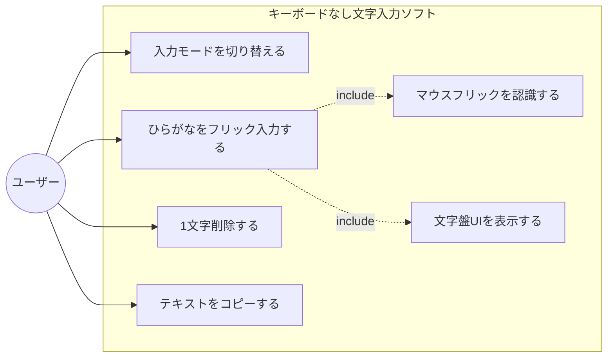
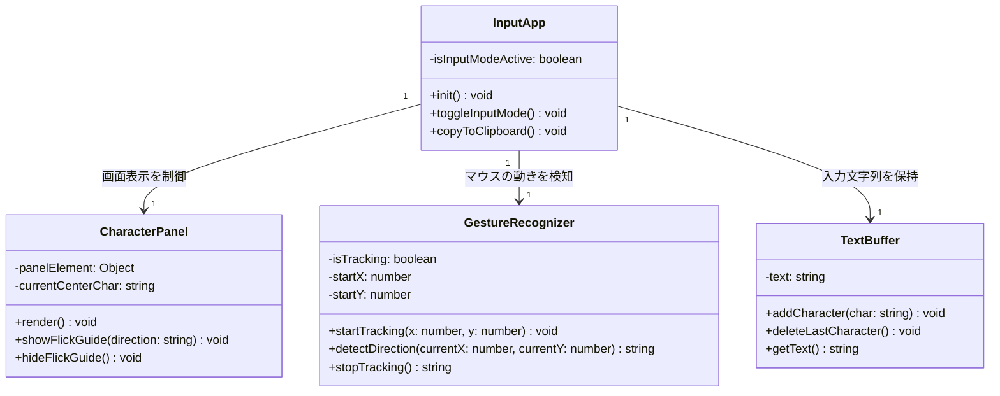
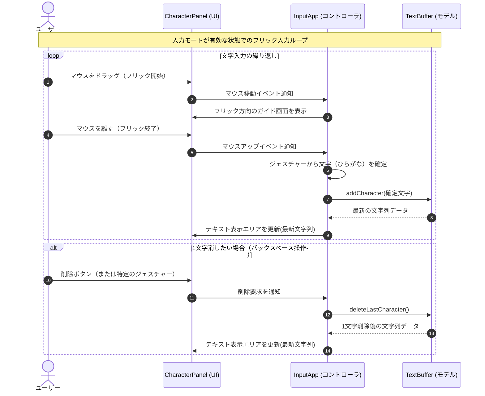
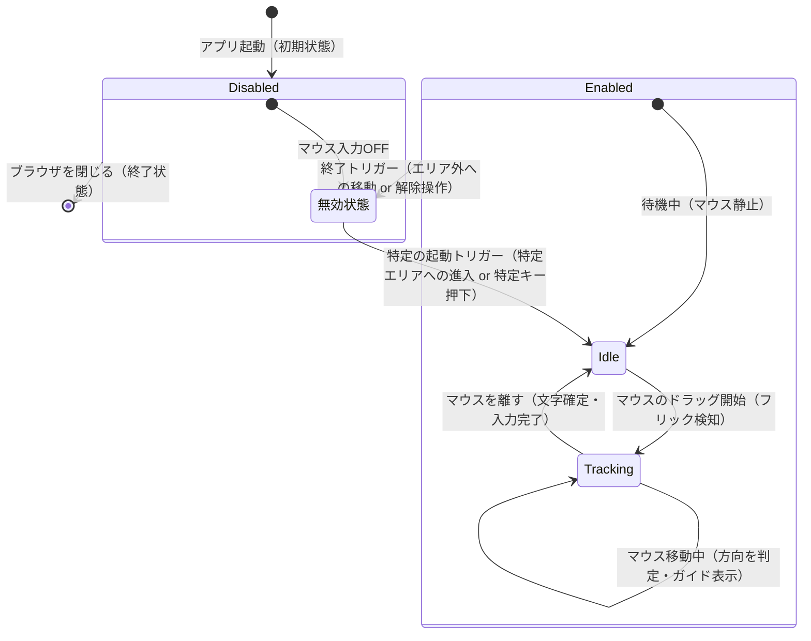

# キーボードなし文字入力ソフト

椅子にもたれかかった楽な姿勢のまま、キーボードに手を伸ばさずマウス操作（フリック等）だけで快適・高速に文字入力を行うためのWebアプリケーションです。

## 1. 要件定義（5要素）

* **【目的】** 椅子にもたれかかった楽な姿勢のまま、キーボードに手を伸ばさずマウス操作（フリック等）だけで快適・高速に文字入力を行う。
* **【利用者の入出力】** 画面上のUIパネル（文字盤）を見ながら、マウスの動きで文字を選択・入力する ➔ 入力されたひらがながテキストエリア等に表示される。
* **【制約】** Webブラウザ上で動作するWebアプリであること。
* **【受け入れ基準】** 最低限、ひらがな50音の入力と表示ができること。
* **【非目標】** カタカナや英数字モードの実装、漢字変換などは今回は作らない（スコープ外）。

## 2. 機能一覧と優先度

### コア機能（アプリの核となる部分）

* **マウスジェスチャー（フリック）認識機能** 【優先度：高】
* マウスの動いた方向（上下左右など）を検知して、どの文字が選ばれたかを判定する機能。

* **文字盤UI表示機能** 【優先度：高】
* スマホのフリック画面のような、視覚的に分かりやすい入力パネルを画面に表示する機能。

* **テキスト出力エリア** 【優先度：高】
* 入力されたひらがなを画面上に次々と表示していくエリア。

### サポート機能（あると便利な部分）

* **一字削除（バックスペース）機能** 【優先度：高】
* 入力を間違えたときに、マウス操作で1文字消せる機能。

* **テキストコピー機能** 【優先度：中】
* 入力したひらがなを一発でクリップボードにコピーして、他のサイトやアプリに貼り付けられるようにする機能。

* **入力モード切り替え（特定の場合のみ起動）** 【優先度：中】
* 常にマウス入力を受け付けると疲れるため、特定のボタンを押している間だけ、または特定の範囲内だけでフリック入力を有効にする切り替え機能。

### 共通機能（システム全体のベース）

* **画面レイアウト（HTML/CSS）** 【優先度：高】
* 文字盤とテキストエリアをブラウザ上にきれいに配置するベース画面。

## 3. 機能要求と非機能要求の分類

### 機能要求（システムが提供する機能）

* マウスジェスチャー（フリック）認識機能
* 文字盤UI表示機能
* テキスト出力エリア表示機能
* 一字削除（バックスペース）機能
* テキストコピー機能
* 入力モード切り替え機能（特定時のみ有効化）

### 非機能要求（システムが満たすべき品質や制約）

* **性能（Performance）**：マウスの動きに対して、遅延（タイムラグ）なくスムーズに文字盤の選択や入力が反映されること。
* **セキュリティ（Security）**：入力された文字データを外部サーバーに送信せず、ブラウザ内（ローカル）だけで安全に処理すること。
* **ユーザビリティ（Usability）**：椅子にもたれて画面から少し離れても文字盤が見やすいよう、UIの大きさや配色に配慮すること。疲労防止のため、特定の操作時のみフリックが反応する誤操作・疲労防止策を入れること。
* **保守性（Maintainability）**：将来的に「カタカナ」や「英数字」のモードを追加したくなったとき、コードを大きく書き直さずに拡張できるようなシンプルな設計にしておくこと。

## 4. 設計図（Mermaid）

### ① ユースケース図風の図

### ② クラス図

### ③ シーケンス図

### ④ 状態遷移図

## 5. 機能規模見積もり（COSMIC法）

主要機能におけるデータの移動を分析し、機能規模を見積もった結果は以下の通りです。

* **① アプリ初期化と画面表示 (4 CFP)**
* アプリがブラウザで起動する（Entry: 1）
* ローカル設定を読み込む（Read: 1）
* 文字盤UIとテキストエリアを表示する（Exit: 1）
* 初期文字盤配置データを保持する（Write: 1）

* **② 入力モード切り替え (3 CFP)**
* ユーザーが切り替えトリガーを操作する（Entry: 1）
* モード状態を更新する（Write: 1）
* 文字盤UIの表示状態を切り替える（Exit: 1）

* **③ 文字フリック操作（ドラッグ中）(3 CFP)**
* ユーザーがマウスを動かす（Entry: 1）
* 現在のマウス座標に対応する文字データを読み込む（Read: 1）
* 選択中方向のガイドをハイライト表示する（Exit: 1）

* **④ 文字確定（フリック終了）(4 CFP)**
* ユーザーがマウスを離す（Entry: 1）
* 確定したひらがなを入力バッファに書き込む（Write: 1）
* 最新の文字列を入力バッファから読み出す（Read: 1）
* テキストエリアを最新文字列に更新する（Exit: 1）

* **⑤ 1文字削除機能 (4 CFP)**
* ユーザーが削除操作を行う（Entry: 1）
* 現在の文字列を読み出す（Read: 1）
* 末尾の1文字を削除してバッファを書き換える（Write: 1）
* テキストエリアの表示を更新する（Exit: 1）

* **⑥ 全文字削除機能 (3 CFP)**
* ユーザーがクリアボタンを押す（Entry: 1）
* 入力バッファを空にリセットする（Write: 1）
* テキストエリアの表示を空にする（Exit: 1）

* **⑦ テキストコピー機能 (4 CFP)**
* ユーザーがコピーボタンを押す（Entry: 1）
* 入力バッファから文字列データを読み出す（Read: 1）
* クリップボードへ文字列を出力する（Exit: 1）
* 画面にコピー完了の通知を表示する（Exit: 1）

**【合計機能規模】：25 CFP**

## 6. 開発環境・起動方法

### 使用技術（予定）

* HTML5
* CSS3
* JavaScript (Vanilla JS)

### 起動方法

1. 本リポジトリをクローンまたはダウンロードします。
2. `index.html` を任意のWebブラウザで開きます。

## 7. 現在動く機能（最終版）

* [x] 行選択ボタンで「あ行〜わ行」を切り替えできる
* [x] 選択中の行に応じた基本ひらがなを、入力パッド上のタップ・上下左右フリックで入力できる
* [x] 補助ボタンから「ー」「、」「。」「？」「！」の記号を入力できる
* [x] 補助ボタンで直前に入力した文字を濁音（゛）、半濁音（゜）、小文字（小）に変換できる
* [x] 削除ボタンで最後の1文字を消去、クリアボタンで全消去できる
* [x] 右クリックや、入力パッド外への大きなドラッグでは誤入力されない
* [x] PC画面では全体を見渡しやすい2列レイアウトで表示できる
* [x] 画面幅が狭い場合は縦並びになるレスポンシブ対応をしている

## 8. 動作確認手順

1. `index.html` をブラウザで開く。
2. 左側の「行選択ボタン」から任意の行を選ぶ。
3. 例として「か行」を選び、右側の「入力パッド」上で以下の操作を行い、文字が入力されるか確認する。

   * クリックしてそのまま離す → 「か」
   * 左にドラッグして離す → 「き」
   * 上にドラッグして離す → 「く」
   * 右にドラッグして離す → 「け」
   * 下にドラッグして離す → 「こ」
4. 「゛」「゜」「小」ボタンを押し、直前に入力した文字が変換されることを確認する。

   * 例：「か」→「が」
   * 例：「は」→「ぱ」
   * 例：「つ」→「っ」
5. 「ー」「、」「。」「？」「！」ボタンを押し、記号が入力されることを確認する。
6. 削除ボタンで最後の1文字が消えることを確認する。
7. クリアボタンで入力内容がすべて消えることを確認する。
8. 右クリックや、入力パッド外へ大きく外れるドラッグ操作で、意図しない文字入力が発生しないことを確認する。
9. ウィンドウ幅を狭め、2列レイアウトから縦並びレイアウトへ自動で切り替わることを確認する。

## 9. 詳細テストケース

最終版のアプリに対して、正常系・境界入力・異常系の3つの視点から、以下の24件のテストケースを作成した。
テストでは、行選択による基本ひらがな入力、記号入力、濁点・半濁点・小文字変換、削除・クリア、異常操作時の安全性を確認する。

| #  | テスト対象    | テスト観点(正常/境界/異常) | テスト条件         | テスト手順(1行)                            | 期待値(1行)                            | 結果 |
| -- | -------- | --------------- | ------------- | ------------------------------------ | ---------------------------------- | -- |
| 1  | 行選択＋フリック | 正常系             | あ行の5方向入力      | 「あ行」を選択し、タップ→左→上→右→下の順に操作する          | テキストエリアに「あいうえお」と表示される              |○|
| 2  | 行選択＋フリック | 正常系             | か行の5方向入力      | 「か行」を選択し、タップ→左→上→右→下の順に操作する          | テキストエリアに「かきくけこ」と表示される              |○|
| 3  | 行選択＋フリック | 正常系             | さ行の5方向入力      | 「さ行」を選択し、タップ→左→上→右→下の順に操作する          | テキストエリアに「さしすせそ」と表示される              |○|
| 4  | 行選択＋フリック | 正常系             | た行の5方向入力      | 「た行」を選択し、タップ→左→上→右→下の順に操作する          | テキストエリアに「たちつてと」と表示される              |○|
| 5  | 行選択＋フリック | 正常系             | な行〜ら行の入力      | な行・は行・ま行・ら行を順に選び、それぞれ5方向入力する         | 各行の文字が選択中の行に応じて正しく入力される            |○|
| 6  | 行選択＋フリック | 正常系             | や行の有効方向入力     | 「や行」を選択し、タップ→上→下の順に操作する              | テキストエリアに「やゆよ」と表示される                |○|
| 7  | 行選択＋フリック | 正常系             | わ行の有効方向入力     | 「わ行」を選択し、タップ→左→上の順に操作する              | テキストエリアに「わをん」と表示される                |○|
| 8  | 行選択表示    | 正常系             | 選択中の行表示       | 「は行」ボタンをクリックする                       | 選択中ボタンの見た目が変わり、入力パッドが「はひふへほ」の表示になる |○|
| 9  | フリック判定   | 境界入力            | 微小なドラッグ移動     | 入力パッド内で左ボタンを押し、数ピクセルだけ動かして離す         | 移動量が閾値未満ならタップ扱いとなり、中央の文字が入力される     |○|
| 10 | フリック判定   | 境界入力            | 斜め方向のドラッグ     | 「か行」を選択し、横移動が縦移動より大きい斜め左上方向へドラッグして離す | 横方向が優先され、「き」が入力される                 |○|
| 11 | や行入力     | 境界入力            | や行の存在しない方向    | 「や行」を選択し、左方向と右方向へフリックする              | 存在しない方向のため、文字は入力されない               |○|
| 12 | わ行入力     | 境界入力            | わ行の存在しない方向    | 「わ行」を選択し、右方向と下方向へフリックする              | 存在しない方向のため、文字は入力されない               |○|
| 13 | 記号入力     | 正常系             | 記号・句読点の入力     | 「ー」「、」「。」「？」「！」ボタンを順に押す              | テキストエリアに「ー、。？！」と表示される              |○|
| 14 | 濁点変換     | 正常系             | か行文字の濁音化      | 「か」を入力した後、「゛」ボタンを押す                  | 「か」が「が」に変換される                      |○|
| 15 | 濁点変換     | 正常系             | 濁音から元の文字へ戻す   | 「が」が表示された状態で、もう一度「゛」ボタンを押す           | 「が」が「か」に戻る                         |○|
| 16 | 半濁点変換    | 正常系             | は行文字の半濁音化     | 「は」を入力した後、「゜」ボタンを押す                  | 「は」が「ぱ」に変換される                      |○|
| 17 | 小文字変換    | 正常系             | 直前文字の小文字化     | 「つ」を入力した後、「小」ボタンを押す                  | 「つ」が「っ」に変換される                      |○|
| 18 | 変換機能     | 境界入力            | 変換できない文字への操作  | 「ん」を入力した後、「゛」「゜」「小」を押す               | 文字は変化せず、アプリがクラッシュしない               |○|
| 19 | 削除機能     | 正常系             | 複数文字からの1字削除   | 「かきく」と入力した状態で「削除」ボタンを押す              | 末尾の「く」のみが削除され、「かき」になる              |○|
| 20 | 削除機能     | 境界入力            | 空欄状態での削除      | テキストエリアが空欄の状態で「削除」ボタンを押す             | 空欄のままで、アプリがクラッシュしない                |○|
| 21 | クリア機能    | 正常系             | 複数文字の一括クリア    | 「あいうえお」と入力した状態で「クリア」ボタンを押す           | 入力内容がすべて削除され、空欄になる                 |○|
| 22 | クリア機能    | 境界入力            | 空欄状態でのクリア     | テキストエリアが空欄の状態で「クリア」ボタンを押す            | 空欄のままで、アプリがクラッシュしない                |○|
| 23 | フリック入力   | 異常系             | 右クリックでの操作     | 入力パッド内で右クリックしながら任意方向へドラッグして離す        | 文字は誤入力されず、アプリがクラッシュしない             |○|
| 24 | フリック入力   | 異常系             | パッド外へ大きく外れる操作 | 入力パッド内で左ボタンを押し、押したまま入力パッド外へ大きく移動して離す | 入力はキャンセルされ、アプリがクラッシュせず次の操作を受け付ける   |○|

## 10. 不具合修正および検証結果のまとめ

旧バージョン（あいうえお簡易版）における初回テストでは、正常系・境界入力は期待通りに動作したものの、異常系の操作において2件の不具合を確認した。

1つ目は、**入力パッド内でドラッグを開始したあと、ブラウザ外または入力パッド外へ大きく移動して離した場合でも、文字が入力されてしまう問題**である。これは、ポインターキャプチャによりドラッグ中の座標検知が継続し、入力パッド外で離した操作もフリック入力として判定されていたことが原因であった。修正として、`inputPad.getBoundingClientRect()` とキャンセル用のマージン値を用いて、入力パッドから大きく外れた位置でマウスを離した場合は、文字を確定せずに操作をキャンセルするよう実装を改善した。

2つ目は、**右クリックでドラッグした場合でも、通常のフリック入力として処理されてしまう問題**である。これは、`pointerdown` イベントで左クリックと右クリックを判別していなかったことが原因であった。修正として、`if (e.button !== 0) return;` を追加し、左クリック以外の操作を入力対象外にした。また、`contextmenu` イベントを抑止し、右クリック操作がフリック入力に影響しないよう対処した。

修正後の再テストでは、右クリックによる誤入力や、入力パッド外へ大きく外れた操作での意図しない入力が安全にキャンセルされ、その後の通常操作も問題なく行えることを確認した。

その後、本プロジェクトの最終調整として、以下の機能を追加した。

* 行選択による基本ひらがな入力
* 記号入力
* 濁点・半濁点・小文字変換
* PC用2列レイアウト改善
* 画面幅に応じたレスポンシブ対応

最終版では、9章に記載した詳細テストケース24件により、仕様通りの動作と異常操作時の安全性を確認する。

## 11. SHIFT良質テスト3視点に基づく品質保証の振り返り

本実習を通じて、以下の3視点からアプリの品質を確認した。

1. **仕様視点（要件どおりの振る舞いか）**
   行選択ボタンとフリック入力により、基本ひらがなの入力と表示ができることを確認した。また、削除、クリア、記号入力、濁点・半濁点変換、小文字変換など、最終版で実装した主要機能が期待通りに動作することをテストケースを通じて確認した。

2. **実装視点（異常な入力・境界値で壊れないか）**
   空欄状態での削除・クリア、存在しない方向へのフリック、変換できない文字に対する変換操作、右クリック、入力パッド外へ大きく外れたドラッグなど、通常とは異なる操作を検証した。その結果、アプリがフリーズやクラッシュを起こさず、安全に処理を無視またはキャンセルできることを確認した。

3. **利用視点（実際の利用者がつまずかないか）**
   入力結果、行選択ボタン、入力パッド、補助ボタン、削除・クリアボタンをPC画面上で見やすく2列に配置し、入力中に主要な操作部品を見失いにくいよう改善した。また、フリック判定のしきい値や、入力パッド外判定の余白を調整し、実際にマウスで操作した際にストレスを感じにくい操作性を目指した。
